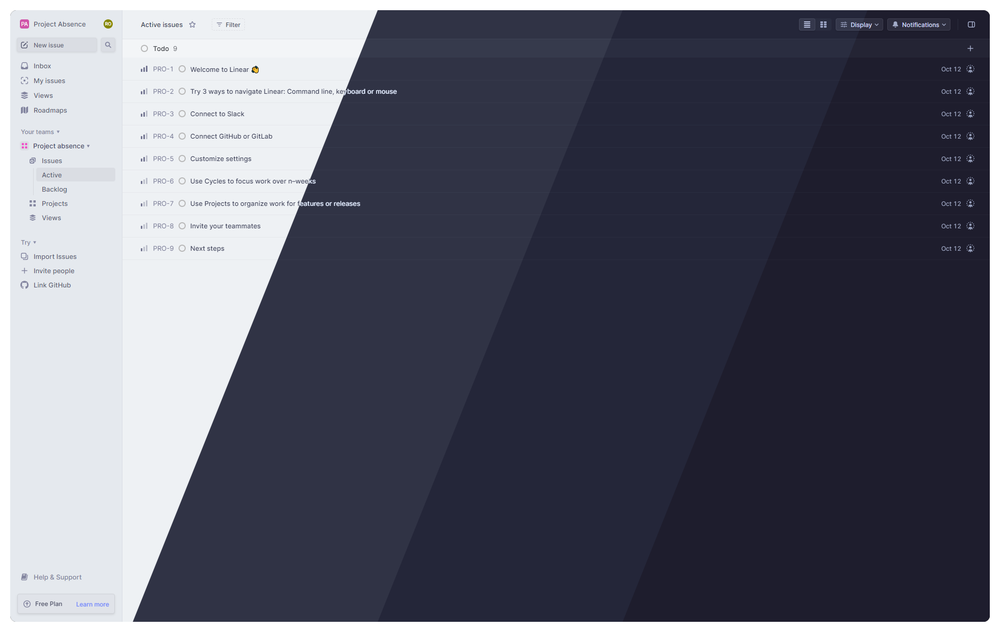
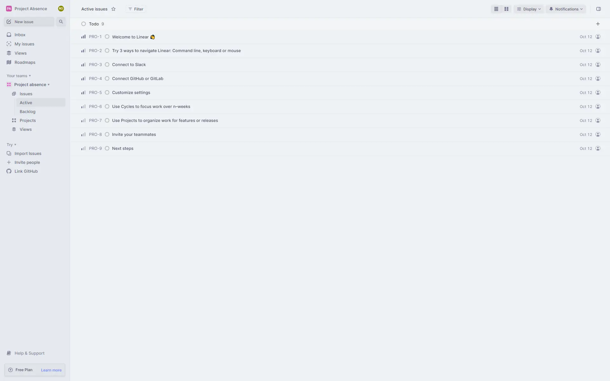
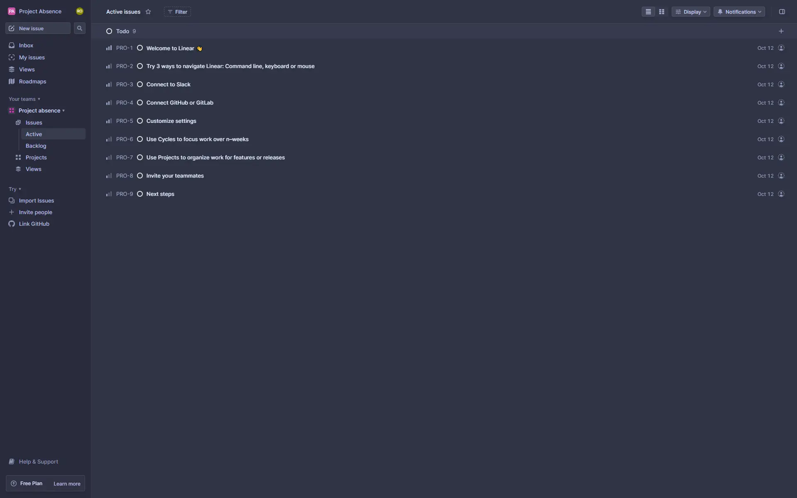
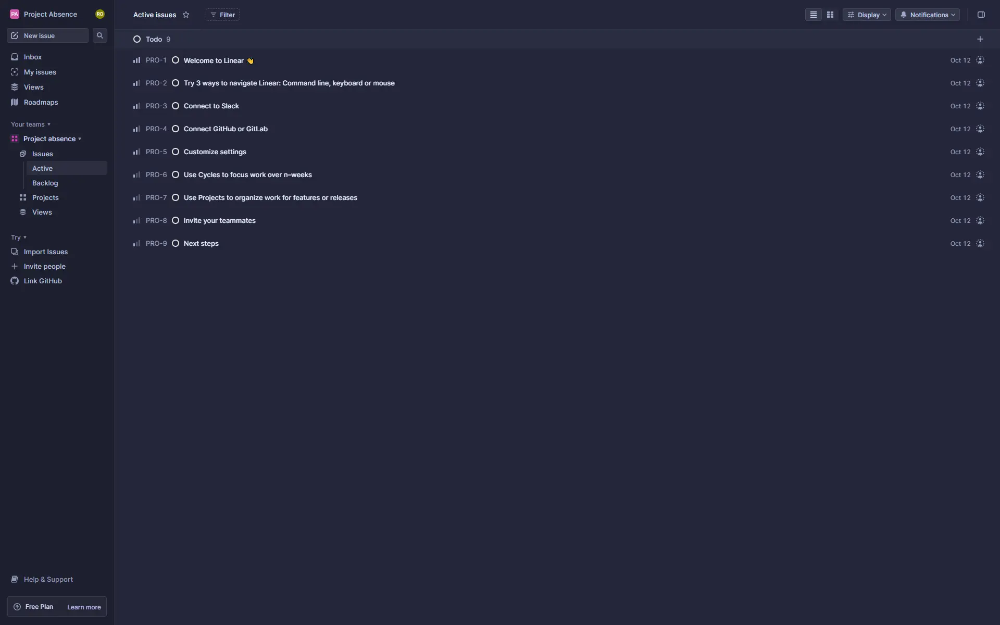
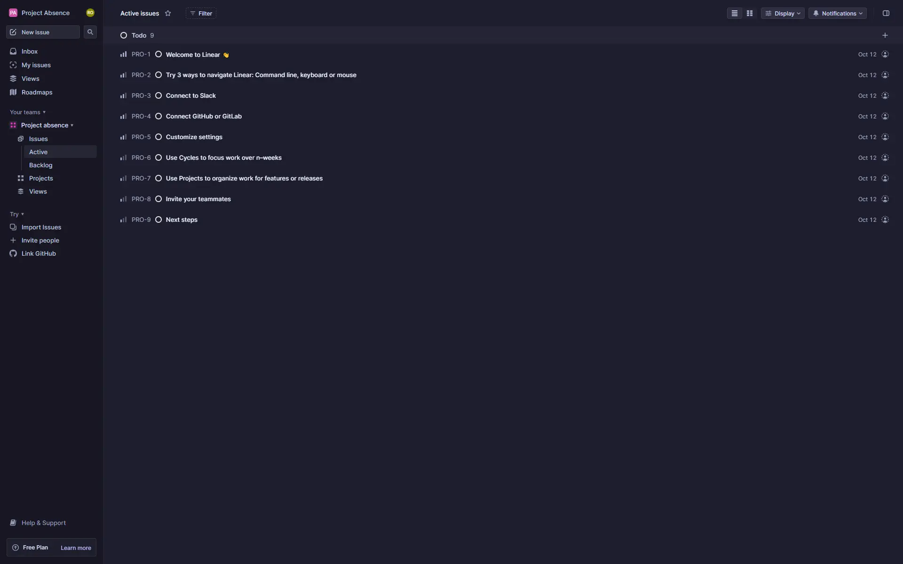

<h3 align="center">
	<br/>
	
	Catppuccin for <a href="https://linear.app">Linear</a>
	
</h3>

<p align="center">
	<a href="https://github.com/catppuccin/linear/stargazers"></a>
	<a href="https://github.com/catppuccin/linear/issues"></a>
	<a href="https://github.com/catppuccin/linear/contributors"></a>
</p>

<p align="center">
	
</p>

## Previews

<details>
<summary>🌻 Latte</summary>

</details>
<details>
<summary>🪴 Frappé</summary>

</details>
<details>
<summary>🌺 Macchiato</summary>

</details>
<details>
<summary>🌿 Mocha</summary>

</details>

## Usage

1. Open the app's settings.
2. Select "Custom" under "Interface theme".
3. In the "Sharing" section at the bottom, click the "Import theme" button, and paste the JSON string from one of the flavour dropdowns below:

<details>
<summary>🌻 Latte</summary>

```json
{"base":[95.07617314910061,2.1856276247566773,265.9705972968138,1],"accent":[43.717135811988086,99.37386079300107,307.12305463765506,1],"contrast":30,"sidebar":{"accent":[43.717135811988086,99.37386079300107,307.12305463765506,1],"base":[92.24441207735264,3.2969488051247637,266.1032348727083,1],"contrast":30}}
```

</details>
<details>
<summary>🪴 Frappé</summary>

```json
{"base":[21.910615795842013,12.010468662173492,279.3277788354938,1],"accent":[71.17945612338404,40.2152504774791,311.3564396598435,1],"contrast":30,"sidebar":{"accent":[71.17945612338404,40.2152504774791,311.3564396598435,1],"base":[18.245074518198138,10.907751370201597,280.5938050419735,1],"contrast":30}}
```

</details>
<details>
<summary>🌺 Macchiato</summary>

```json
{"base":[16.02115422223583,13.102236978320558,282.51213623981425,1],"accent":[71.7932136171783,46.50946588741101,305.26693753987405,1],"contrast":30,"sidebar":{"accent":[71.7932136171783,46.50946588741101,305.26693753987405,1],"base":[12.630274385042,11.320088214998314,283.5543011836976,1],"contrast":30}}
```

</details>
<details>
<summary>🌿 Mocha</summary>

```json
{"base":[11.858911555975908,11.316733254070215,288.18047966235713,1],"accent":[73.7154870022496,43.723380621299455,305.70194648307285,1],"contrast":30,"sidebar":{"accent":[73.7154870022496,43.723380621299455,305.70194648307285,1],"base":[8.740545194349792,9.47503299768768,288.0147550692609,1],"contrast":30}}
```

</details>

## 🙋 FAQ

- Q: **_"I want another accent color, is it possible?"_**\
  A: After importing the theme, you can easily change the accent color via hex code.

## 💝 Thanks to

- [Krypton](https://github.com/kkrypt0nn)

&nbsp;

<p align="center">
	
</p>

<p align="center">
	Copyright &copy; 2021-present <a href="https://github.com/catppuccin" target="_blank">Catppuccin Org</a>
</p>

<p align="center">
	<a href="https://github.com/catppuccin/catppuccin/blob/main/LICENSE"></a>
</p>
